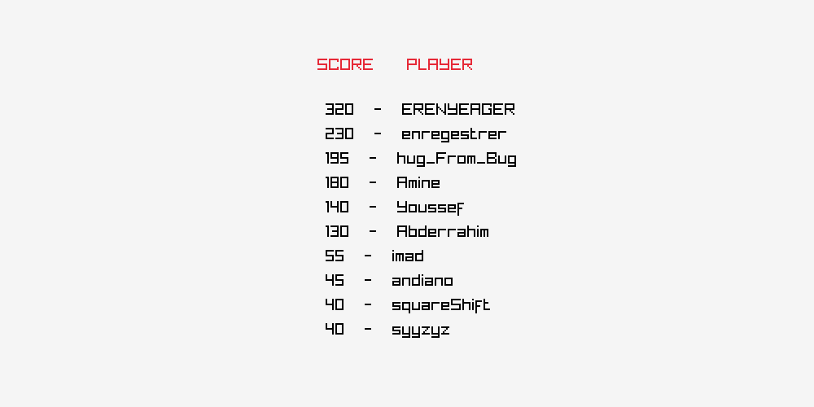

# Tetris

This is a simple Tetris game written in C++ using the [Raylib](https://www.raylib.com/) library.

<video src="explanatory_video.mp4" height="240" controls></video>

## Features

- **Start New Game**: Allows players to start a new game.
- **Load Saved Game**: Load and continue from a previously saved game state.
- **Game Controls**: Provides a list of controls to help players understand how to play the game.
- **Game Rules**: Provides a list of rules to help players understand how to play the game.
- **Levels**: Has multiple levels, each with a different difficulty.
- **Recorded Scores**: The game records high scores and displays them.

## Installation

1. Clone the repository

```bash
    git clone https://github.com/AbderrahimeEl/Tetris
```

2. Install the Raylib library from the official website: [Raylib](https://www.raylib.com/)

3. Compile the game using the provided Makefile

```bash
    make
```

4. Play Time!

```bash
    ./bin/tetris.exe
```

## Screenshots

- **Main Menu** :
  
- **Game** :
  
- **Controls** :
  
- **Rules** :
  
- **Levels** :
  
- **Recorded Scores** :
  

## Contributors

<a href="https://github.com/AbderrahimeEl/Tetris/graphs/contributors">
  
</a>
